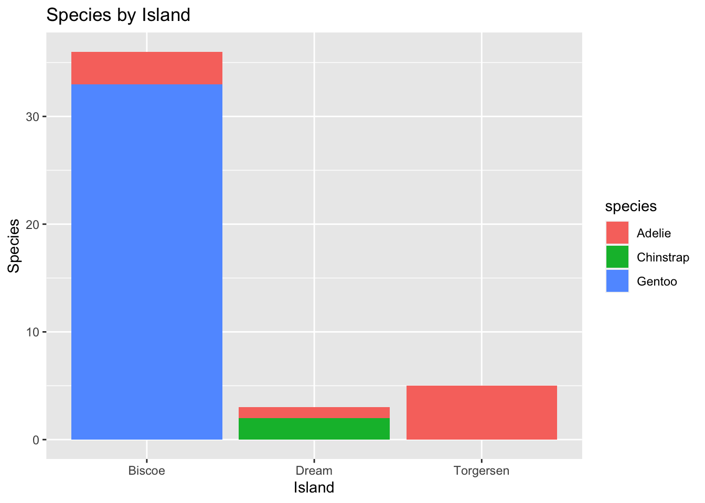

## Palmer Penguins Analysis

This is an analysis of the Palmer's Penguin dataset.

## Loading Packages and Datasets

Here we will load the tidyverse package and penguins data.


::: {.cell}

```{.r .cell-code}
#Load the tidyverse
library(tidyverse)
```

::: {.cell-output .cell-output-stderr}
```
── Attaching packages ─────────────────────────────────────── tidyverse 1.3.2 ──
✔ ggplot2 3.4.0      ✔ purrr   1.0.0 
✔ tibble  3.1.8      ✔ dplyr   1.0.10
✔ tidyr   1.2.1      ✔ stringr 1.5.0 
✔ readr   2.1.3      ✔ forcats 0.5.2 
── Conflicts ────────────────────────────────────────── tidyverse_conflicts() ──
✖ dplyr::filter() masks stats::filter()
✖ dplyr::lag()    masks stats::lag()
```
:::

```{.r .cell-code}
library(kableExtra)
```

::: {.cell-output .cell-output-stderr}
```

Attaching package: 'kableExtra'

The following object is masked from 'package:dplyr':

    group_rows
```
:::

```{.r .cell-code}
#Read the penguins_samp1 data file from github
penguins <- read_csv("https://raw.githubusercontent.com/mcduryea/Intro-to-Bioinformatics/main/data/penguins_samp1.csv")
```

::: {.cell-output .cell-output-stderr}
```
Rows: 44 Columns: 8
── Column specification ────────────────────────────────────────────────────────
Delimiter: ","
chr (3): species, island, sex
dbl (5): bill_length_mm, bill_depth_mm, flipper_length_mm, body_mass_g, year

ℹ Use `spec()` to retrieve the full column specification for this data.
ℹ Specify the column types or set `show_col_types = FALSE` to quiet this message.
```
:::

```{.r .cell-code}
#See the first six rows of the data we've read in to our notebook
penguins %>%
  head() %>%
  kable() %>%
  kable_styling(c("hover", "striped"))
```

::: {.cell-output-display}

`````{=html}
<table class="table table-hover table-striped" style="margin-left: auto; margin-right: auto;">
 <thead>
  <tr>
   <th style="text-align:left;"> species </th>
   <th style="text-align:left;"> island </th>
   <th style="text-align:right;"> bill_length_mm </th>
   <th style="text-align:right;"> bill_depth_mm </th>
   <th style="text-align:right;"> flipper_length_mm </th>
   <th style="text-align:right;"> body_mass_g </th>
   <th style="text-align:left;"> sex </th>
   <th style="text-align:right;"> year </th>
  </tr>
 </thead>
<tbody>
  <tr>
   <td style="text-align:left;"> Gentoo </td>
   <td style="text-align:left;"> Biscoe </td>
   <td style="text-align:right;"> 59.6 </td>
   <td style="text-align:right;"> 17.0 </td>
   <td style="text-align:right;"> 230 </td>
   <td style="text-align:right;"> 6050 </td>
   <td style="text-align:left;"> male </td>
   <td style="text-align:right;"> 2007 </td>
  </tr>
  <tr>
   <td style="text-align:left;"> Gentoo </td>
   <td style="text-align:left;"> Biscoe </td>
   <td style="text-align:right;"> 48.6 </td>
   <td style="text-align:right;"> 16.0 </td>
   <td style="text-align:right;"> 230 </td>
   <td style="text-align:right;"> 5800 </td>
   <td style="text-align:left;"> male </td>
   <td style="text-align:right;"> 2008 </td>
  </tr>
  <tr>
   <td style="text-align:left;"> Gentoo </td>
   <td style="text-align:left;"> Biscoe </td>
   <td style="text-align:right;"> 52.1 </td>
   <td style="text-align:right;"> 17.0 </td>
   <td style="text-align:right;"> 230 </td>
   <td style="text-align:right;"> 5550 </td>
   <td style="text-align:left;"> male </td>
   <td style="text-align:right;"> 2009 </td>
  </tr>
  <tr>
   <td style="text-align:left;"> Gentoo </td>
   <td style="text-align:left;"> Biscoe </td>
   <td style="text-align:right;"> 51.5 </td>
   <td style="text-align:right;"> 16.3 </td>
   <td style="text-align:right;"> 230 </td>
   <td style="text-align:right;"> 5500 </td>
   <td style="text-align:left;"> male </td>
   <td style="text-align:right;"> 2009 </td>
  </tr>
  <tr>
   <td style="text-align:left;"> Gentoo </td>
   <td style="text-align:left;"> Biscoe </td>
   <td style="text-align:right;"> 55.1 </td>
   <td style="text-align:right;"> 16.0 </td>
   <td style="text-align:right;"> 230 </td>
   <td style="text-align:right;"> 5850 </td>
   <td style="text-align:left;"> male </td>
   <td style="text-align:right;"> 2009 </td>
  </tr>
  <tr>
   <td style="text-align:left;"> Gentoo </td>
   <td style="text-align:left;"> Biscoe </td>
   <td style="text-align:right;"> 49.8 </td>
   <td style="text-align:right;"> 15.9 </td>
   <td style="text-align:right;"> 229 </td>
   <td style="text-align:right;"> 5950 </td>
   <td style="text-align:left;"> male </td>
   <td style="text-align:right;"> 2009 </td>
  </tr>
</tbody>
</table>

`````

:::
:::


## About Our Data

The data we are working with is a data set on Penguins, which includes 8 features measured on 44 Penguins. The features that are included are physiological features (like bill length, bill depth, flipper length, body mass, etc.) as well as other features, like the year the Penguin was observed, the Island the Penguin was observed on, the sex of the Penguin, and the species of the Penguin.

## Interesting Questions to Ask

-   What is the average flipper length? What about for each species?

-   Are there more male or female Penguins? What about per island or species?

-   What is the average body mass? What about by Island? By species? By sex?

-   What is the ratio of bill length to bill depth for a Penguin? What is the overall average of this metric? Does it change by species, sex, or island?

-   Does average body mass change by year?

## Data Manipulation Tools and Strategies

We can look at individual columns in a data set or subsets of columns in a data set. For example, if we are only interested in flipper length and species, we can `select()` those column.


::: {.cell}

```{.r .cell-code}
penguins %>%
  select(species, body_mass_g)
```

::: {.cell-output .cell-output-stdout}
```
# A tibble: 44 × 2
   species body_mass_g
   <chr>         <dbl>
 1 Gentoo         6050
 2 Gentoo         5800
 3 Gentoo         5550
 4 Gentoo         5500
 5 Gentoo         5850
 6 Gentoo         5950
 7 Gentoo         5700
 8 Gentoo         5350
 9 Gentoo         5550
10 Gentoo         6300
# … with 34 more rows
```
:::
:::


If we want to `filter()` and only show certain rows, we can do that too.


::: {.cell}

```{.r .cell-code}
#we can filter by sex (categorical variables)
penguins %>%
  filter(species == "chinstrap")
```

::: {.cell-output .cell-output-stdout}
```
# A tibble: 0 × 8
# … with 8 variables: species <chr>, island <chr>, bill_length_mm <dbl>,
#   bill_depth_mm <dbl>, flipper_length_mm <dbl>, body_mass_g <dbl>, sex <chr>,
#   year <dbl>
```
:::

```{.r .cell-code}
#we can also filter by numerical variables
penguins %>%
  filter(body_mass_g >= 6000)
```

::: {.cell-output .cell-output-stdout}
```
# A tibble: 2 × 8
  species island bill_length_mm bill_depth_mm flipper_leng…¹ body_…² sex    year
  <chr>   <chr>           <dbl>         <dbl>          <dbl>   <dbl> <chr> <dbl>
1 Gentoo  Biscoe           59.6          17              230    6050 male   2007
2 Gentoo  Biscoe           49.2          15.2            221    6300 male   2007
# … with abbreviated variable names ¹​flipper_length_mm, ²​body_mass_g
```
:::

```{.r .cell-code}
#we can also do both
penguins %>%
  filter((body_mass_g >= 6000) | (island == "Torgersen"))
```

::: {.cell-output .cell-output-stdout}
```
# A tibble: 7 × 8
  species island    bill_length_mm bill_depth_mm flipper_l…¹ body_…² sex    year
  <chr>   <chr>              <dbl>         <dbl>       <dbl>   <dbl> <chr> <dbl>
1 Gentoo  Biscoe              59.6          17           230    6050 male   2007
2 Gentoo  Biscoe              49.2          15.2         221    6300 male   2007
3 Adelie  Torgersen           40.6          19           199    4000 male   2009
4 Adelie  Torgersen           38.8          17.6         191    3275 fema…  2009
5 Adelie  Torgersen           41.1          18.6         189    3325 male   2009
6 Adelie  Torgersen           38.6          17           188    2900 fema…  2009
7 Adelie  Torgersen           36.2          17.2         187    3150 fema…  2009
# … with abbreviated variable names ¹​flipper_length_mm, ²​body_mass_g
```
:::
:::


## Answering Our Questions

Most of our questions involve summarizing data, and perhaps summarizing over groups. We can summarize data using the `summarize()` function, and group data using `group_by()`.

Let's find the average flipper length.


::: {.cell}

```{.r .cell-code}
#overall average flipper length
penguins %>%
  summarize(avg_flipper_length = mean(flipper_length_mm))
```

::: {.cell-output .cell-output-stdout}
```
# A tibble: 1 × 1
  avg_flipper_length
               <dbl>
1               212.
```
:::

```{.r .cell-code}
#single species average 
penguins %>%
  filter(species == "Gentoo") %>%
  summarize(avg_flipper_length = mean(flipper_length_mm))
```

::: {.cell-output .cell-output-stdout}
```
# A tibble: 1 × 1
  avg_flipper_length
               <dbl>
1               218.
```
:::

```{.r .cell-code}
#grouped average
penguins %>%
  group_by(species) %>%
  summarize(avg_flipper_length = mean (flipper_length_mm))
```

::: {.cell-output .cell-output-stdout}
```
# A tibble: 3 × 2
  species   avg_flipper_length
  <chr>                  <dbl>
1 Adelie                  189.
2 Chinstrap               200 
3 Gentoo                  218.
```
:::
:::


How many of each species do we have?


::: {.cell}

```{.r .cell-code}
penguins %>%
  count(species)
```

::: {.cell-output .cell-output-stdout}
```
# A tibble: 3 × 2
  species       n
  <chr>     <int>
1 Adelie        9
2 Chinstrap     2
3 Gentoo       33
```
:::
:::


Are there more males of females penguins?


::: {.cell}

```{.r .cell-code}
penguins %>%
  count(sex)
```

::: {.cell-output .cell-output-stdout}
```
# A tibble: 2 × 2
  sex        n
  <chr>  <int>
1 female    20
2 male      24
```
:::

```{.r .cell-code}
penguins %>%
  group_by(species) %>%
  count(sex)
```

::: {.cell-output .cell-output-stdout}
```
# A tibble: 6 × 3
# Groups:   species [3]
  species   sex        n
  <chr>     <chr>  <int>
1 Adelie    female     6
2 Adelie    male       3
3 Chinstrap female     1
4 Chinstrap male       1
5 Gentoo    female    13
6 Gentoo    male      20
```
:::

```{.r .cell-code}
penguins %>%
  group_by(island) %>%
  count(sex)
```

::: {.cell-output .cell-output-stdout}
```
# A tibble: 6 × 3
# Groups:   island [3]
  island    sex        n
  <chr>     <chr>  <int>
1 Biscoe    female    15
2 Biscoe    male      21
3 Dream     female     2
4 Dream     male       1
5 Torgersen female     3
6 Torgersen male       2
```
:::
:::


We can use a function called mutate to add new columns to our data set.


::: {.cell}

```{.r .cell-code}
penguins %>%
  mutate(bill_ltd_ratio = bill_length_mm / bill_depth_mm)
```

::: {.cell-output .cell-output-stdout}
```
# A tibble: 44 × 9
   species island bill_length_mm bill_dept…¹ flipp…² body_…³ sex    year bill_…⁴
   <chr>   <chr>           <dbl>       <dbl>   <dbl>   <dbl> <chr> <dbl>   <dbl>
 1 Gentoo  Biscoe           59.6        17       230    6050 male   2007    3.51
 2 Gentoo  Biscoe           48.6        16       230    5800 male   2008    3.04
 3 Gentoo  Biscoe           52.1        17       230    5550 male   2009    3.06
 4 Gentoo  Biscoe           51.5        16.3     230    5500 male   2009    3.16
 5 Gentoo  Biscoe           55.1        16       230    5850 male   2009    3.44
 6 Gentoo  Biscoe           49.8        15.9     229    5950 male   2009    3.13
 7 Gentoo  Biscoe           49.6        16       225    5700 male   2008    3.1 
 8 Gentoo  Biscoe           50          15.9     224    5350 male   2009    3.14
 9 Gentoo  Biscoe           50.5        15.9     222    5550 male   2008    3.18
10 Gentoo  Biscoe           49.2        15.2     221    6300 male   2007    3.24
# … with 34 more rows, and abbreviated variable names ¹​bill_depth_mm,
#   ²​flipper_length_mm, ³​body_mass_g, ⁴​bill_ltd_ratio
```
:::
:::

::: {.cell}

```{.r .cell-code}
penguins_with_ratio <- penguins %>% 
  mutate(bill_ltd_ratio = bill_length_mm / bill_depth_mm)

#average ratio
penguins %>%
  mutate(bill_ltd_ratio = bill_length_mm / bill_depth_mm) %>%
  summarize(mean_bill_ltd_ratio = mean(bill_ltd_ratio), 
            median_bill_ltd_ratio = median(bill_ltd_ratio))
```

::: {.cell-output .cell-output-stdout}
```
# A tibble: 1 × 2
  mean_bill_ltd_ratio median_bill_ltd_ratio
                <dbl>                 <dbl>
1                2.95                  3.06
```
:::
:::


average body mass by year


::: {.cell}

```{.r .cell-code}
penguins %>%
  group_by(year) %>%
  summarize(mean_body_mass = mean(body_mass_g))
```

::: {.cell-output .cell-output-stdout}
```
# A tibble: 3 × 2
   year mean_body_mass
  <dbl>          <dbl>
1  2007          5079.
2  2008          4929.
3  2009          4518.
```
:::
:::


## Data Visualization

-   What is the distribution of penguin flipper length?

-   What is the distribution of penguin species?

-   Does the distribution of flipper length depend on the species of the penguin?


::: {.cell}

```{.r .cell-code}
penguins %>%
  ggplot() +
  geom_bar(mapping = aes(x = species)) +
  labs(title ="Counts of Penguin Species", x = "Species", y = "Count")
```

::: {.cell-output-display}
{width=672}
:::
:::

::: {.cell}

```{.r .cell-code}
penguins %>%
  ggplot() +
  geom_histogram(mapping = aes(x = bill_length_mm),
                 color = "white",
                 fill = "blue") +
  labs(title ="Distribution of Bill Lengths",
       x = "Bill Length (mm)", y = "Count")
```

::: {.cell-output .cell-output-stderr}
```
`stat_bin()` using `bins = 30`. Pick better value with `binwidth`.
```
:::

::: {.cell-output-display}
{width=672}
:::
:::

::: {.cell}

```{.r .cell-code}
penguins %>%
  ggplot() +
  geom_histogram(mapping = aes(x = flipper_length_mm),
                 bins = 15,
                 fill = "forestgreen",
                 color = "black") +
  labs(title = "Distribution of Flipper Length (mm)",
       #subtitle: "mean in black, median in purple"
       y = "", x = "Flipper Length (mm)") +
  geom_vline(aes(xintercept = mean(flipper_length_mm)), lwd = 2, lty = "dashed") +
  geom_vline(aes(xintercept = median(flipper_length_mm)), color = "purple", lwd = 2,   lty = "dotted")
```

::: {.cell-output .cell-output-stderr}
```
Warning: Using `size` aesthetic for lines was deprecated in ggplot2 3.4.0.
ℹ Please use `linewidth` instead.
```
:::

::: {.cell-output-display}
{width=672}
:::
:::


Let's make a scatter plot to see if bill length is correlated with bill depth.


::: {.cell}

```{.r .cell-code}
penguins %>%
  ggplot() +
  geom_point(mapping=aes(x = bill_depth_mm, y = bill_length_mm, color = species)) +
  geom_smooth(aes(x = bill_depth_mm, y = bill_length_mm, color = species), method = "lm") +
  labs(title = "Bill Depth and Length",
       x = "Bill Depth (mm)",
       y = "Bill Length (mm)")
```

::: {.cell-output .cell-output-stderr}
```
`geom_smooth()` using formula = 'y ~ x'
```
:::

::: {.cell-output .cell-output-stderr}
```
Warning in qt((1 - level)/2, df): NaNs produced
```
:::

::: {.cell-output .cell-output-stderr}
```
Warning in max(ids, na.rm = TRUE): no non-missing arguments to max; returning
-Inf
```
:::

::: {.cell-output-display}
{width=672}
:::
:::


We will now look at the distribution of species.


::: {.cell}

```{.r .cell-code}
penguins %>%
  ggplot() +
  geom_bar(mapping = aes(x = species), color = "purple", fill = "pink") +
  labs(title = "Counts of Penguin Species",
       x = "Species",
       y = "count")
```

::: {.cell-output-display}
{width=672}
:::
:::

::: {.cell}

```{.r .cell-code}
penguins %>%
  ggplot() +
  geom_bar(mapping = aes(x = island, fill = species)) +
  labs(title = "Species by Island",
       x = "Island",
       y = "Species")
```

::: {.cell-output-display}
{width=672}
:::
:::

::: {.cell}

```{.r .cell-code}
penguins %>%
  ggplot() +
  geom_boxplot(mapping = aes(x = bill_depth_mm, y = species)) +
  labs(title = "Bill Depth by Species",
       x = "Bill Depth (mm)",
       y = "Median")
```

::: {.cell-output-display}
{width=672}
:::
:::

::: {.cell}

```{.r .cell-code}
penguins %>%
  ggplot() +
  geom_histogram(mapping = aes(x = bill_depth_mm)) +
  facet_wrap(~species, ncol = 1) +
  labs(title = "Bill Depth by Species",
       x = "Bill Depth (mm)",
       y = "mean")
```

::: {.cell-output .cell-output-stderr}
```
`stat_bin()` using `bins = 30`. Pick better value with `binwidth`.
```
:::

::: {.cell-output-display}
{width=672}
:::
:::

::: {.cell}

```{.r .cell-code}
penguins %>%
  filter(!is.na(sex)) %>%
  ggplot() +
  geom_point(mapping = aes(x = bill_length_mm,
                           y = flipper_length_mm,
                           color = species,
                           shape = sex)) +
  geom_smooth(mapping = aes(x = bill_length_mm,
                            y = flipper_length_mm,
                            color = species),
              method = "lm") +
  facet_grid(island ~ sex, scales = "free") +
  labs(title = "Flipper and Bill Lengths by Species and Sex",
       x = "Bill Length (mm)",
       y = "Flipper Length (mm)") +
  theme_light()
```

::: {.cell-output .cell-output-stderr}
```
`geom_smooth()` using formula = 'y ~ x'
```
:::

::: {.cell-output .cell-output-stderr}
```
Warning in qt((1 - level)/2, df): NaNs produced

Warning in qt((1 - level)/2, df): NaNs produced
```
:::

::: {.cell-output .cell-output-stderr}
```
Warning in max(ids, na.rm = TRUE): no non-missing arguments to max; returning
-Inf

Warning in max(ids, na.rm = TRUE): no non-missing arguments to max; returning
-Inf
```
:::

::: {.cell-output-display}
{width=672}
:::
:::
